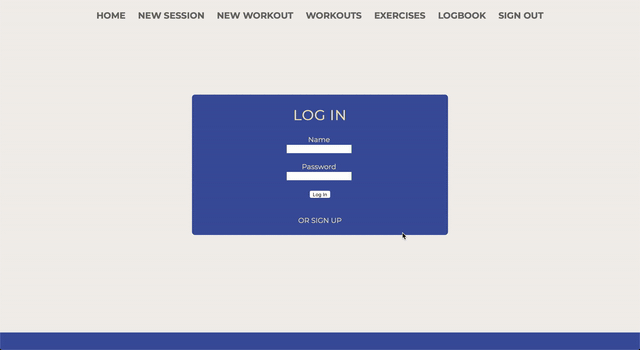

# Workout Manager

* This Fitness Manager web application will help a user create a regular workout schedule and stick to it! 

To use the app, a user will first have to create an account using a username, email, and password. He can then sign in thereafter using his username and password. 

Once signed in, the user can use this app to schedule  sessions - choosing what time a session should take place, where it should occur, what the session goal is, and what workouts should be included in the session. 

The user can also create workouts, where are ordered sequences of exercises that the  the user is expected to do repeatedly and regularly. When making a workout, the user can specify the number of sets (optional), number of reps (optional), and estimated duration of the exercise. These workouts can then be added to scheduled sessions. 

When building a workout, the user can choose what types of exercises to include in it. The app comes with a public library of common exercises such as 'sit-ups' and 'jogging', but the user can also create his own. 

The user's dashboard, or his home page, will display his active sessions and future sessions, as well as his gym details where he can add a new gym or edit and delete an existing gym. On this dashhboard, he can also edit and delete active or upcoming sessions. 

Active sessions, which have a starting time in the closest 1-hour block to the current time, have an additional functionality - they can be 'activated.' Activation brings the user to a screen where a timer will show and he can begin doing the exercises according to the duration he allotted to each (skipping forward to the next exercise if one finishes early is also allowed). 
